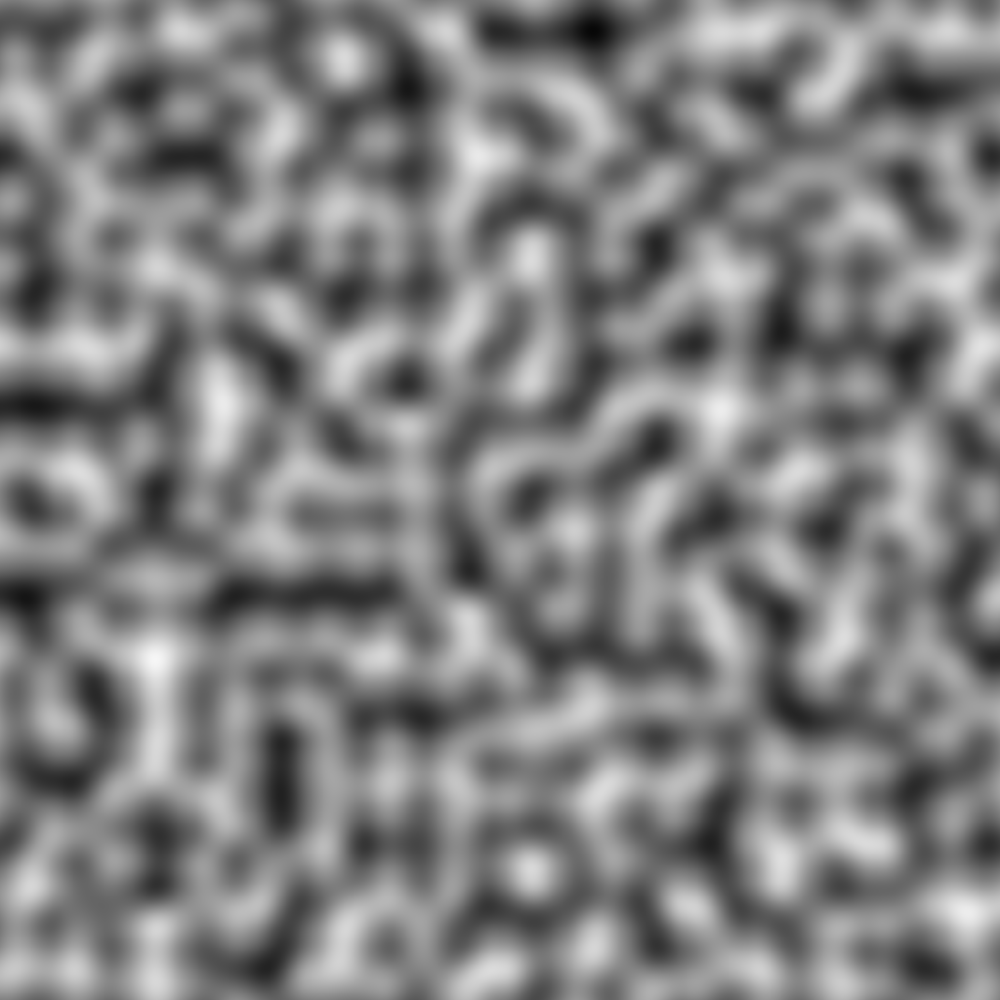
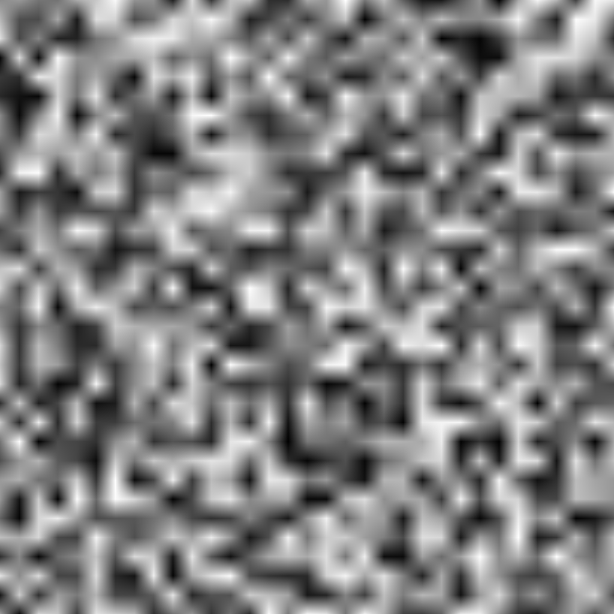
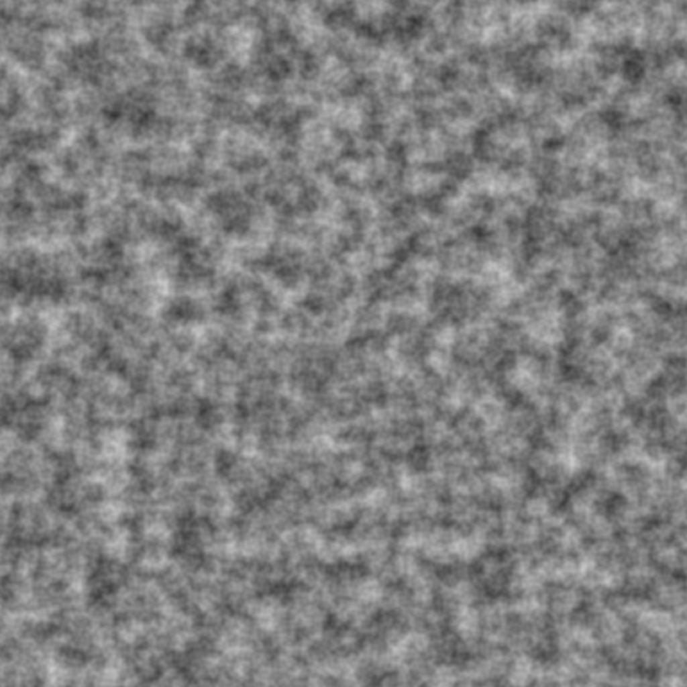
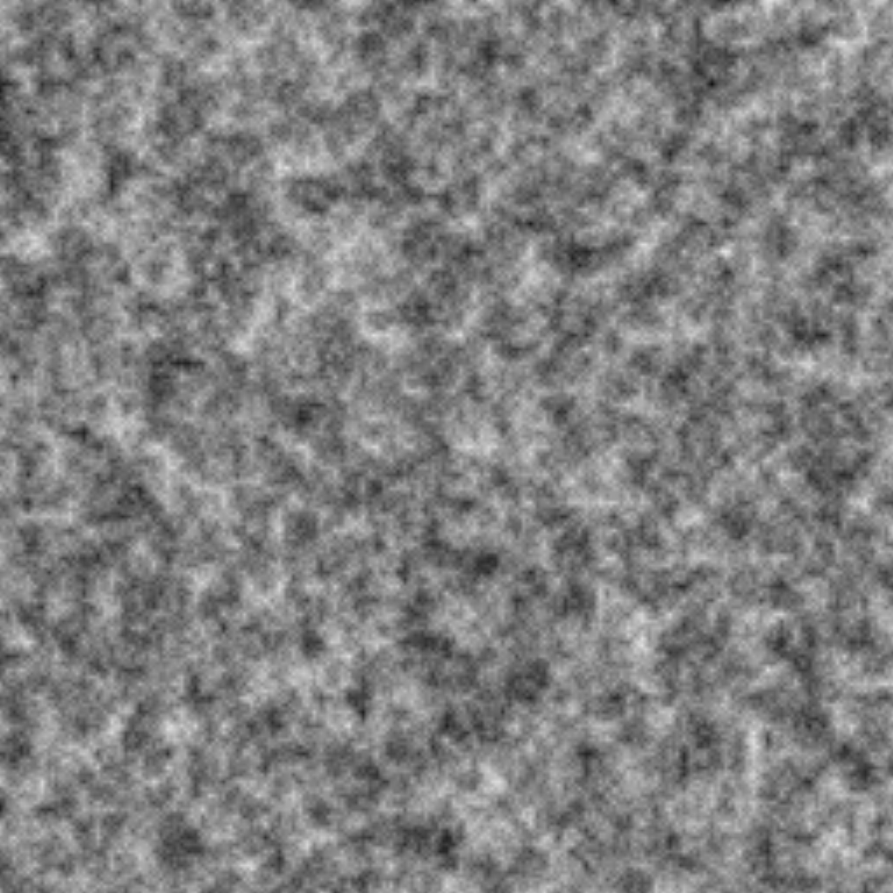

# Noilib simple

This is just a simple implementation of perlin noise and value noise made in rust.

##### A simple example

```rs
use noilib_simple::NoiseGenerator;

fn main() {
    let seed = 123;
    let noise = NoiseGenerator::new(seed); // Initializing noise generator

    let x = 1.0;
    let y = 5.5;
    println!("{}", noise.perlin(x, y)); // Print the noise value at x and y coordinates
}
```

## Some examples of noises this library is able to produce

### Perlin noise



### Value noise



### Perlin noise with 4 octaves



### Value noise with 4 octaves


